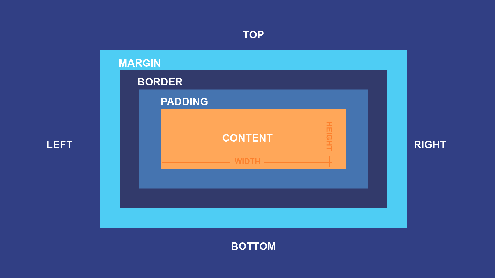

#  CSS

## 📌 Add CSS to HTML

-   Just use the link tag in the head with the CSS fille

```html
<link rel="stylesheet" href="/CSS/page.css" />
```

## 📌 Selectors

-   Tag Selectors

```css
body {
    color: aliceblue;
    background-color: #303030;
    font-family: Verdana, Geneva, Tahoma, sans-serif;
}
```

-   Id Selectors

```css
#soggyCat {
    width: 20%;
    height: 20%;
}
```

-   Class Selectors

```css
.pogClass {
    width: 100px;
    height: 100px;
    background-color: red;
}
```

-   Concatenating ( using more than one selector at the same time )

```css
div button {
    background-color: blue;
}
```

-   Pseudo-classes ( little actions like hover, click, etc )

```scss
#soggyCat:hover {
    width: 30%;
    height: 30%;
}
```

## 📌 Box Model

-   Padding —> First Background ( Internal distance TILL CONTENT )
-   Border —> Can be COLORED and format can CHANGE
-   Margin —> Transparent and Determines the SPACE till other components



## 📌 Border

-   How to modify the border

```css
#soggyCat {
    border-style: solid;
    border-width: 5px;
    border-color: #ffffff;
    border-radius: 10px 10px 10px 10px;
}

// Or //

#soggyCat {
    border: 3px solid #ffffff;
    border-radius: 10px 10px 10px 10px;
    width: 20%;
    height: 20%;
}
```

## 📌 Text

-   Style the font, color, weight, etc

```css
body {
    color: aliceblue;
    font-style: normal;
    font-weight: lighter;
    font-family: Verdana, Geneva, Tahoma, sans-serif;
    background-color: #303030;
}
```

## 📌 Display

-   Display Block - Fill all the horizontal space

```css
.box {
    background-color: chocolate;
    display: block;
}
```


-   Display Inline - The size is the exact content size

```css
.box {
    background-color: chocolate;
    display: inline;
}
```


-   Display Inline-Block - The size is just the exact content size, BUT you can modify it to fill more

```css
.box1 {
    background-color: chocolate;
    display: inline-block;
    width: 100px;
}

.box2 {
    background-color: chocolate;
    display: inline-block;
    width: 200px;
}
```


## 📌 Position

-   Static - Normal and Default flux position
    -   Can’t be modified ( top, left, z-index, etc )
-   Absolute - Related to the closest father
    -   Doesn’t create any aditional space on the page
    -   Doesn’t follow the normal flux of the site
    -   The other elements will just ignore the position of the absolute ones ( ignore them )
    -   With absolute you can modify the position on the page ( left, right, top, bottom )

```html
<div class="normal"></div>
<div class="absolute"></div>
<div class="normal"></div>
```

```css
.normal {
    width: 100px;
    height: 100px;
    background: green;
}

.absolute {
    width: 100px;
    height: 100px;
    background: red;
}

// Using Absolute //

.absolute2 {
    position: absolute;
    width: 100px;
    height: 100px;
    background: red;
}
```


-   Relative - Related to the normal flux of the site ( related to static )
    -   When you make position changes, the start point is the static position
    -   Does create aditional space on the page ( and it really is in the new space )
    -   The other elements will respect like if the element was static

```html
<div class="normal"></div>
<div class="relative"></div>
<div class="normal"></div>
```

```css
.normal {
    width: 100px;
    height: 100px;
    background: green;
    display: inline-block;
}

.relative {
    position: relative;
    left: 50px;
    width: 100px;
    height: 100px;
    background: red;
    display: inline-block;
}
```


-   Fixed - Fixed in the page ( always the same position )
    -   It ignores ALL other elements ( and them ignore it too )

```
<div id="fixedCat">
    <h2>Fixed Boy:</h2>
	  
</div>
```

```css
#fixedCat {
    position: fixed;
    top: 2%;
    right: 3%;
    text-align: center;
}

#staringCat {
    width: 60%;
    border: 3px solid #55ff00;
    border-radius: 5px;
}
```


## 📌 Z-index

-   Defines which elements will be on the front or in the back
-   Greater number == In front

```html
<div class="normal2"></div>
<div class="relative2"></div>
```

```css
.relative2 {
    position: relative;
    left: -40px;
    width: 400px;
    height: 100px;
    background: red;
    display: inline-block;
    z-index: -1;
}

.normal2 {
    width: 100px;
    height: 100px;
    background: green;
    display: inline-block;
}
```


## 📌 Measure Units

-   Px - Pixels
-   % - Relate to the size of the container
-   Rem - Equivalent to the fontsize of the Root
-   Vw - % of the viewer screen
-   Vh - % of the viewer screen

```html
<h2>Measure Units:</h2>

<div class="catCard">
    
</div>

<div class="catCard">
    
</div>

<div class="catCard">
    
</div>

<div class="catCard">
    
</div>
```

```css
.catCard {
    position: static;
    display: inline;
}

#sillyCat1 {
    width: 10%;
    border: 3px solid #55ff00;
    border-radius: 5px;
    margin-right: 2%;
}

#sillyCat2 {
    width: 100px;
    border: 3px solid #55ff00;
    border-radius: 5px;
    margin-right: 2%;
}

#sillyCat3 {
    width: 8vw;
    border: 3px solid #55ff00;
    border-radius: 5px;
    margin-right: 2%;
}

#sillyCat4 {
    width: 8rem;
    border: 3px solid #55ff00;
    border-radius: 5px;
    margin-right: 2%;
}
```


## 📌 Animations and Transitions

-   Basically just set the transition element and a pseudo-class
-   1° - Set the basic CSS
-   2° - Set the modified form

```html

```

```css
.cat {
    border: 3px solid #55ff00;
    border-radius: 10px 10px 10px 10px;
    width: 20%;
    height: 20%;
    transition: 0.5s ease;      # Transition Animation
}

.cat:hover {
    width: 30%;
    height: 30%;
}
```

## 📌 Flexbox

-   It’s a way to automate the process of displaying elements
-   Flexbox works using flex-container ( Parent ) and flex-items ( Children )


## 📌 Flexbox - Container Properties

-   Display

```css
.container {
    display: flex;
}
```

-   Flex Direction - Defines the orientation of the Main Axis ( element disposition )
    -   Default : ROW

```css
.container {
    flex-direction: row | row-reverse | column | column-reverse;
}
```


-   Flex Wrap - Defines if the flex-elements can “broke line” to rearrange them-selves
    -   Default : NOWRAP

```css
.container {
    flex-wrap: nowrap | wrap | wrap-reverse;
}
```


-   Jutify Content - Alignment along the Main Axis
    -   Default : FLEX-START

```css
.container {
    justify-content: flex-start | flex-end | center | space-between |
        space-around | space-evenly;
}
```


-   Align Items - Alignment along the Cross Axis
    -   Defult : STRETCH ( respects the max/min width )

```css
.container {
    align-items: stretch | flex-start | flex-end | center | baseline;
}
```


-   Gap - Space between flex-items

```css
.container {
    display: flex;
    ...
    gap: 10px 20px;
}
```


## 📌 Flexbox - Item Properties

-   Align-Self - Allows a single flex-item to align itself a part of the default alignment

```css
.item {
    align-self: auto | flex-start | flex-end | center | baseline | stretch;
}
```


-   Flex-Grow - A way to make a flex-item bigger than others

```css
.item {
    flex-grow: 4;
}
```


-   Flex-Shrink - A way to make a flex-item smaller than others

```css
.item {
    flex-shrink: 3;
}
```

## 📌 A Flexbox Example:

```html
<h2>Basic Flexbox Demonstration:</h2>
<div id="flexContainer">
    <div class="flexItem"></div>
    <div class="flexItem"></div>
    <div class="flexItem"></div>
</div>
```

```css
#flexContainer {
    background: rgb(152, 93, 211);
    padding: 2rem;
    display: flex;
    flex-direction: row;
    flex-wrap: wrap;
    justify-content: space-evenly;
    align-items: center;
}

.flexItem {
    padding: 4rem;
    background: rgb(220, 200, 44);
    border-radius: 10px;
    margin: 15px;
}
```


```html
<h2>More Flexbox Demonstration:</h2>
<div id="flexContainer2">
    <div class="flexItem2"></div>
    <div class="flexItem2"></div>
    <div class="flexItem2"></div>
</div>
```

```css
#flexContainer2 {
    background: rgb(152, 93, 211);
    padding: 2rem;
    display: flex;
    flex-direction: row;
    flex-wrap: wrap;
    gap: 3rem;
    align-items: center;
}

.flexItem2 {
    padding: 4rem;
    background: rgb(220, 200, 44);
    border-radius: 10px;
    margin: 15px;
    flex-grow: 1;
}
```


## 📌 Sources:

https://github.com/mathh95/css4noobs

[ css4noobs | He4art ](https://css-tricks.com/snippets/css/a-guide-to-flexbox/)

[CSS Unit Guide: CSS em, rem, vh, vw, and more, Explained](https://www.freecodecamp.org/news/css-unit-guide/)

[A Complete Guide to Flexbox | CSS-Tricks](https://css-tricks.com/snippets/css/a-guide-to-flexbox/)
